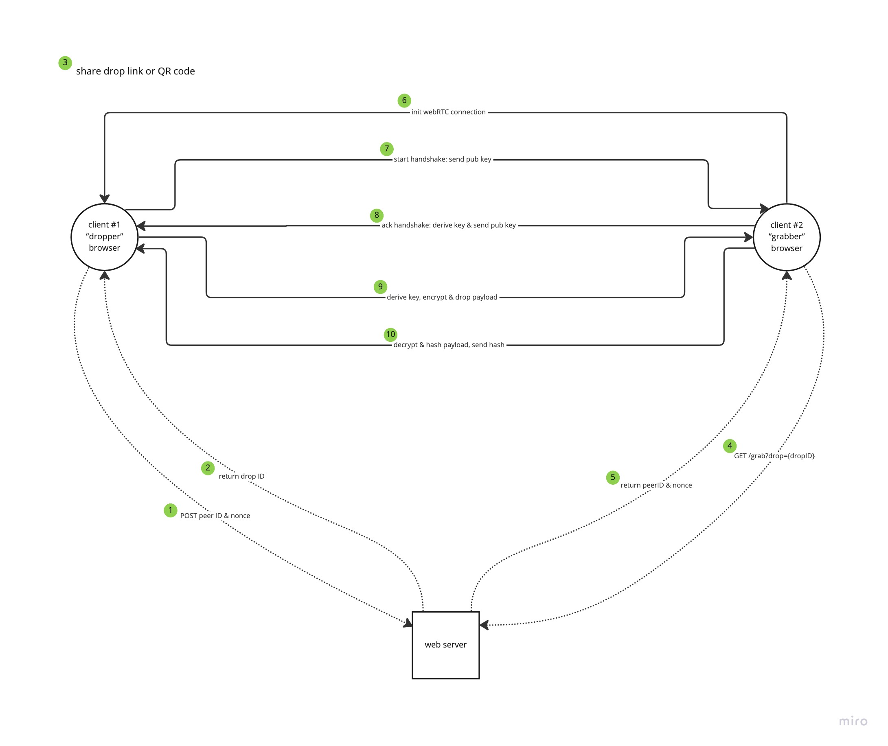

# deadrop

[](https://github.com/dallen4/deadrop/actions/workflows/web_ci_workflow.yml) [](https://github.com/dallen4/deadrop/actions/workflows/cli_pkg_workflow.yml)

*deadrop* is an e2e encrypted secret sharing platform that leverages the [Web Crypto API](https://developer.mozilla.org/en-US/docs/Web/API/Web_Crypto_API).

## How it Works

Utilizing public key infrastructure patterns, deadrop uses AES (with GCM) and Eliptical Curve (ECDH) cryptographic methods to generate keys and obfuscate payloads then SHA-256 is used after handoff for verifying data integrity. All keys are exchanged through peer-to-peer connections over WebRTC allowing all key and payload communications to remain solely between the two peers ("dropper" and "grabber") and are not logged or tracked by any server-side functionality. An opaque drop ID, the dropper's peer ID, and a nonce for the drop session are stored in a redis instance. The dropper's peer ID and nonce are then retrieved for the grabber by sending GET request to the `/api/drop` endpoint.



## Features

- [x] raw text secret sharing
- [x] JSON string secret sharing
- [x] secret file sharing
- [x] basic captcha protection via [hcaptcha](https://www.hcaptcha.com/)
- [ ] CLI implementation (in-progress)
  - [x] text
  - [ ] files
- [ ] multi-user sharing
- [ ] drop passcode protection

## Using the Web Application

To use the web application, visit https://deadrop.io. It is a PWA so you can also save it to your home screen on your mobile devices.

## Using the CLI

If you want to drop or grab a secret using the CLI implementation, you can install it by running:

```bash
npm install deadrop
npm run deadrop ...
```

Or if you want to run it without installing it within your project:

```bash
npx deadrop ...
```
